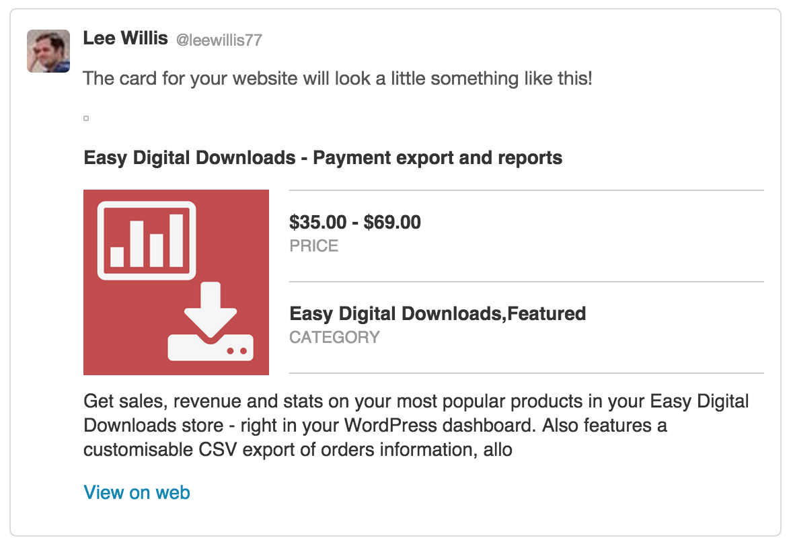

# Twitter card markup for Easy Digital Downloads

Adds Twitter card markup for EDD downloads, maximizing the impact of tweets about your product.

## Installation

1. Install, and activate the plugin, just as you would any other WordPress plugin.
1. Once activated, the plugin goes straight to work, no setup, no manual adjustment of templates - twitter card meta tags will be added
to your product pages.
1. Before cards will show up on twitter, you'll have to validate your tags using the
[online validator](https://cards-dev.twitter.com/validator).
1. Once you've received confirmation that your
site has been whitelisted you should be good to go.

## What information is sent?

The plugin sets the following elements:

* twitter:site
    * Your site's title, pulled direct for WordPress' settings.
* twitter:title
    * The product title.
* twitter:description
    * A short excerpt, pulled from your download's excerpt.
* twitter:label1 / data1
    * Your product's price - accepts free, single price, and variable price products.
* twitter:label2 / data2
    * The product's categories, comma separated if there are multiple.

## Can I change the information sent?

Yes, there is a WordPress filter called *edd_twitter_cards_meta* that gets passed the default set of generated
content and the download post so you can override whichever elements you want.

## Is the plugin translatable?

I'm afraid not - [patches welcome](https://github.com/leewillis77/edd-twitter-cards/issues) :)

## Where can I get support?

I can't provide any support for this plugin unless it's on a paid-for basis. If you do wish to go ahead, please
get in touch via [my contact form](http://plugins.leewillis.co.uk/contact/).